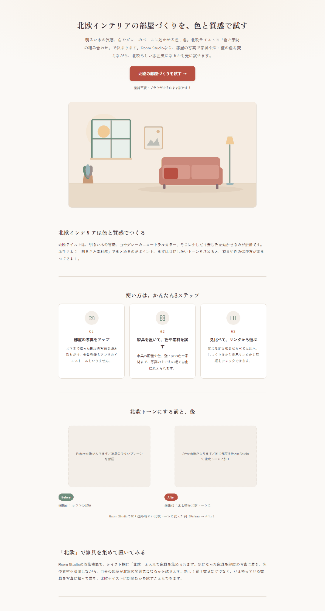
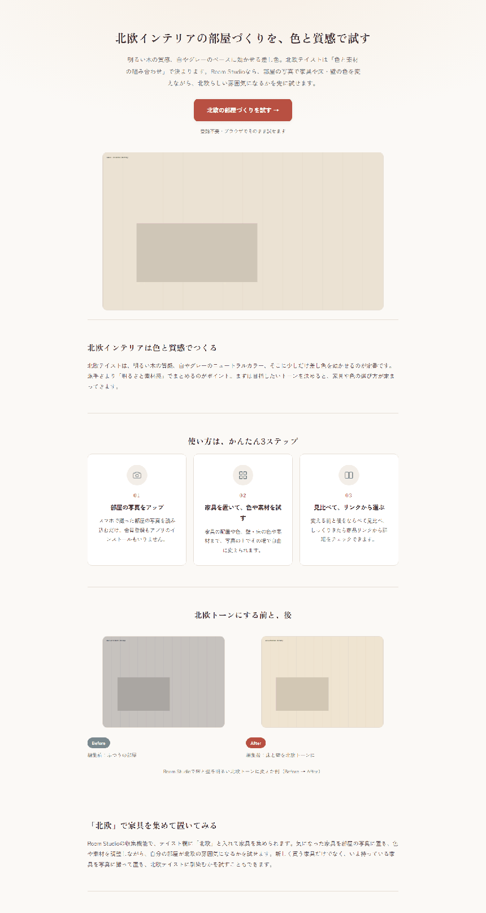
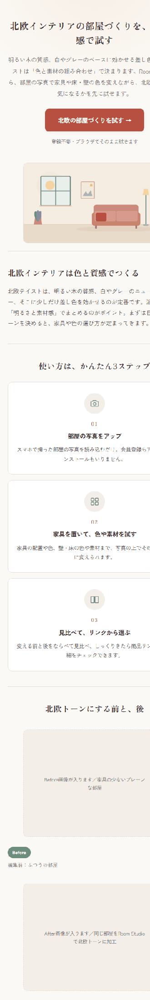

# LP before/after 枠 + ヒーロー差し替え — 完了報告

ブランチ: `feature/lp-beforeafter`（main 未マージ。マージは運営判断）
対象: 北欧LP `/lp/hokuo-interior` のみ

## 1. 要約：大半は着手前から実装済みだった

指示書の §1（before/after 枠）・§2（ヒーロー差し替え構造）・§3（画像仕様書）は、
**着手時点ですでに実装・ドキュメント化されていた**（LP刷新時に作り込み済み）。
本番HTMLの実測でも、枠のコードは存在し `lp-assets/` が空だから出ていないだけと確認できた。

したがって今回の実作業は「ゼロから実装」ではなく、**指示書と既存実装の差分3点の解消**である。

| # | 差分 | 対応 |
|---|---|---|
| 1 | 未配置時にプレースホルダを出すか（指示書=出す / 既存=`efe8927` で非表示に確定） | 運営に確認のうえ**指示書通り常時表示**に。ただし北欧LPのみ |
| 2 | ヒーローが `loading="lazy"` 固定（指示書=eager） | ヒーローのみ `eager` + `fetchpriority="high"` に |
| 3 | 明示 `width`/`height` 不在（`aspect-ratio` のみでCLSは防げていた） | 二重の保険として実寸属性も付与 |

判断の根拠と却下した選択肢は `docs/LP_BEFOREAFTER_PLAN.md` に記録。

## 2. 変更点（`api/_site.py` のみ）

- `_img(name, alt, cls, w, h, eager=False)` — 実寸 `width`/`height` を付与。`eager` でヒーローだけ先読み。
- `_img_ph(cls, note)` **新規** — 空スロットの破線プレースホルダ。`.ph` を丸ごと再利用するので
  実画像と**寸法・背景・中央寄せが完全に同一**。`aria-hidden="true"` で支援技術からは隠す（足場であって内容ではないため）。
- `landing_html()` — LPデータの `ph: True` で「未配置でもプレースホルダを出す」挙動に切り替え。
  各画像に `note_b`/`note_a` をキャプションとして描画（指示書§1「各画像にキャプション欄」）。
- 北欧LPのデータに `"ph": True` と `ph_b`/`ph_a`（プレースホルダ文言）を追加。
- CSS: `.ba-note`（各画像キャプション）、`.ph-empty{border-style:dashed}`、`.ph-note`。計6行。

**比較スライダーは実装していない**（指示書で「任意」、かつ「まずは静的横並びで確実に」の方針）。

## 3. 検証結果

### 他3LPが未変更であること（機械的検証）
main 版と本ブランチで全4LPをレンダリングして比較:

```
BODY UNCHANGED  6jo-hitorigurashi-layout
BODY UNCHANGED  chintai-kabe-makeover
BODY UNCHANGED  hitorigurashi-sofa
BODY CHANGED    hokuo-interior          ← 意図通り
```

他3LPの差分は共有スタイルシートに増えた**未使用のCSS 6行のみ**で、`<body>` はバイト単位で不変。

### 本文・メタ等の不変性（指示書 §0-2）
北欧LPの main 版との比較:

| 対象 | base | new | 判定 |
|---|---|---|---|
| meta タグ | 11 | 11 | 一致 |
| title / canonical・link | 1 / 4 | 1 / 4 | 一致 |
| JSON-LD（LP + FAQPage） | 2 | 2 | 一致 |
| FAQ 項目 | 2 | 2 | 一致 |
| 本文セクション | 3 | 3 | 一致 |
| `<a href>` 全件（内部リンク・アプリ導線・楽天） | 9 | 9 | 一致 |
| CTA | 2 | 2 | 一致 |
| `<h2>` | 8 | 9 | **+1**＝新セクション見出し「北欧トーンにする前と、後」のみ |

追加は新セクションの見出し1つだけで、他はすべて完全一致。

### レイアウト（headless Edge 実測）

| 画面 | 結果 |
|---|---|
| 未配置・デスクトップ 1280px |  |
| 未配置・モバイル 390px | 2列→**1列に縦積み**。文字は読める（右端の見切れはキャプチャ幅の癖で、main版でも同一に発生＝本変更とは無関係） |
| 配置後・デスクトップ |  |

**CLSなし**: 未配置と配置後でセクションの位置・寸法が一致。プレースホルダが実画像とまったく同じ
箱を占有するため、あとからファイルを置いてもレイアウトは動かない。
モバイル: 

### 画像属性
配置状態でレンダリングして確認:

```html


```

alt はすべて日本語で内容を説明（例「Room Studioで床と壁を北欧トーンに変えた部屋」）。
追加JSはゼロ。

## 4. 運営が用意すべき画像（この表が制作の設計図）

置き場所は **リポジトリ直下の `lp-assets/`**。ファイル名は下記のとおり、**拡張子は任意**
（`.webp` 推奨 / `.jpg` `.png` `.avif` 可。自動判別されます）。置いて `git add lp-assets/ && commit && push`
すれば本番に出ます。

| # | ファイル名 | 比率 | 推奨実寸 | 上限 | 中身 |
|---|---|---|---|---|---|
| 1 | `hokuo-interior-hero` | 16:9 | 1600×900 px | 300KB | 明るい木の質感の**北欧テイストな無人リビング**（横長）。Claude Design で作成、またはフリー素材。**置かなければ現行のSVGイラストのまま**で問題なし |
| 2 | `hokuo-interior-before` | 4:3 | 800×600 px | 150KB | **家具の少ないプレーンな部屋**。これが加工前の状態 |
| 3 | `hokuo-interior-after` | 4:3 | 800×600 px | 150KB | **上記2と同じ部屋**を Room Studio に読み込み、家具配置・床壁の色を北欧トーンに変えた**実際のキャプチャ** |

### 厳守事項

- **before と after は同じ部屋・同じ画角**で。違う部屋だと対比の説得力が失われる。
- **after は必ず Room Studio の実出力**。フリー素材やモックで代用しない（この枠は
  「実際にこう変えられる」の証明であり、実機能に準拠していることが存在理由）。
- フリー素材を使う場合は**商用可・帰属不要**のみ。**人物・ブランド/商標の写り込みは不可**。
  **API経由で取得せず手動DL**したファイルを使う（詳細は `docs/LP_IMAGE_GUIDE.md`）。
- 配置前に圧縮（[Squoosh](https://squoosh.app/) で横幅リサイズ＋品質75前後）。

before/after は**2枚そろって初めて意味を持つ**が、片方だけ置いても崩れはせず、
未配置側がプレースホルダのまま残る。

## 5. 受け入れチェックリスト

- [x] `feature/lp-beforeafter` 上で北欧LPに before/after 枠を実装
- [x] プレースホルダで未配置でも崩れない／同一比率（4:3）／Before・Afterラベルとキャプション付き
- [x] ヒーローが差し替え可能構造（実ファイル優先、無ければ現行SVGイラストにフォールバック）
- [x] モバイル縦積み・CLSなし・alt/実寸/lazy（ヒーローのみ eager）
- [x] 本文/FAQ/内部リンク/メタ/JSON-LD/アプリ導線/楽天リンクが不変（機械的に検証）
- [x] `docs/LP_IMAGE_GUIDE.md` を更新（スロット表・プレースホルダ方針）
- [x] `docs/LP_BEFOREAFTER_PLAN.md` / 本レポートを作成
- [x] 北欧LPのみ対象（他3枚は `<body>` 不変を検証）

## 6. 横展開の手順（後日、良ければ）

`api/_site.py` の対象LPのdictに `"ph": True` と `ba` の `ph_b`/`ph_a` 文言を足すだけ。
レンダリング側の変更は不要。
