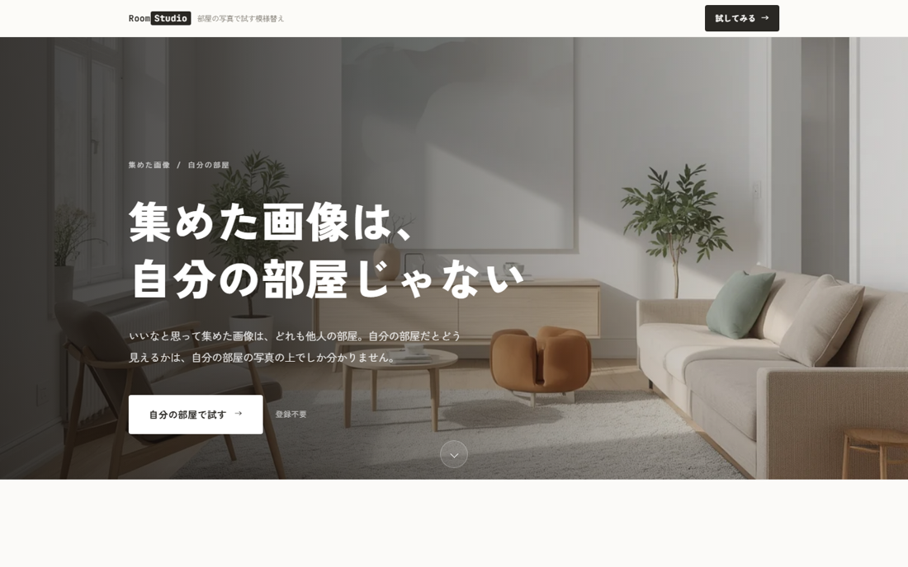
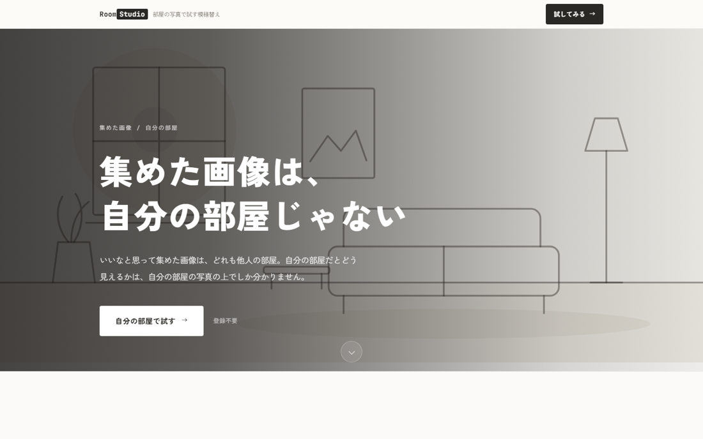
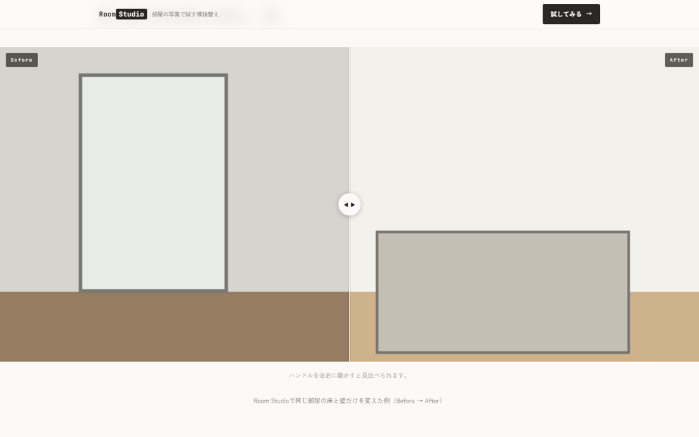
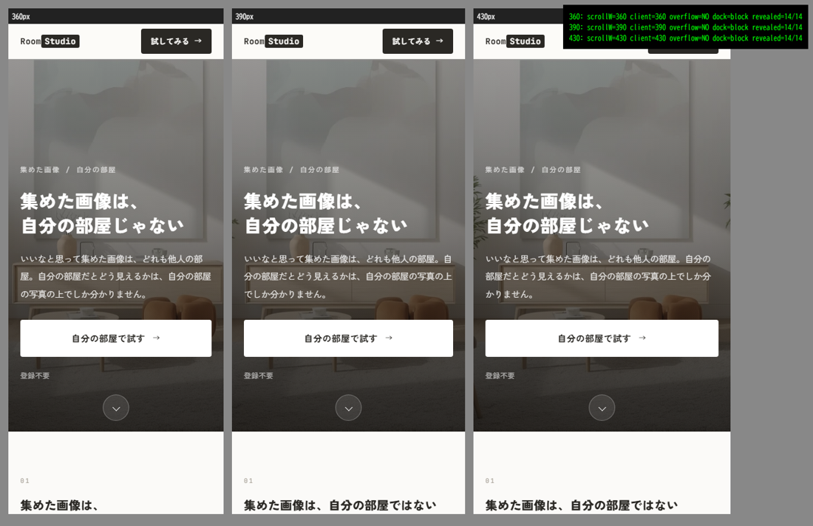

# LP ヒーロー刷新 実装レポート（2026-07-28）

対象: `/lp/moyougae-simulation`／ブランチ `feature/lp-hero`／変更は `api/_site.py` と `docs/`。
計画は `docs/LP_HERO_PLAN.md`。**main へは未マージ**。

## 1. 何を変えたか

### 1-1. ヒーロー：フルブリード＋画像の上にテキスト

| | 変更前 | 変更後 |
|---|---|---|
| 構造 | テキストブロックの下に画像帯（テキストは画像の外） | **画面幅いっぱいの画像の上にテキスト** |
| 高さ | 成り行き | **78vh**（デスクトップ実測 78.0vh・モバイル 76.0vh）・`max-height:900px` |
| テキスト | eyebrow・H1・リード3文・CTA・注記3項目 | **H1 ＋ リード2文 ＋ CTA1つ ＋「登録不要」**（eyebrowは小ラベルとして残置） |
| 可読性 | — | **暗いグラデーションのスクリムを必ず挿入**（下記の計算値） |
| スクロール手がかり | なし | **下向き矢印**（`<a href="#start">`＝キーボード到達可）＋ 78vh により次セクションが覗く |
| H1 | `clamp(26px,5vw,52px)` | **`clamp(30px,6.2vw,68px)`**・字間 `.035em`（モバイルは `.02em` に縮小） |

**スクリムのコントラスト設計**（白文字を任意の写真に載せるため、最悪ケースで設計）

- デスクトップは横方向グラデーション。テキストが乗る左側の不透明度は **.66〜.78**
- 最悪ケース＝真っ白な写真（255）に .66 → 255×0.34 = 87 → 白文字とのコントラスト比 **約7.0:1**
- SVGイラストにフォールバックした場合（地の色 #F4F2ED）→ **約9.7:1**
- いずれも WCAG AA（通常文字 4.5:1）を満たす。モバイルは縦方向グラデーションに切り替え、
  テキスト帯で同等の濃度を確保

### 1-2. レイアウト

- **セクション間余白**: `clamp(56px,8vw,108px)` → **`clamp(72px,10vw,140px)`**（目安100〜140px）
- **ビジュアルのリズム**: before/after を**フルブリードの帯**にして「テキスト → 大きな画像 → テキスト」を作った。
  高さは `min(72vh,700px)` で頭打ち（全幅に 16:9 を適用すると810px超になり画面を飲み込むため）
- **プレースホルダ状態は本文幅のまま**。画面いっぱいの破線の空箱は出さない

### 1-3. before/after の推奨比率を 4:3 → 16:9 に変更

フルブリードの帯で見せるため。**まだ1枚も作っていないので作り直しは発生しない**。

## 2. 検証結果（数値）

### 2-1. 情報量 — 削除・要約していないこと（変更前＝main と機械比較）

| 指標 | 変更前 | 変更後 | 判定 |
|---|---|---|---|
| 本文セクション数 | 3 | **3** | 一致 |
| 本文の総字数 | 542 | **542** | 一致 |
| 本文見出しの総字数 | 51 | **51** | 一致 |
| FAQ設問数 | 3 | **3** | 一致 |
| FAQ設問の総字数 | 79 | **79** | 一致 |
| FAQ回答の総字数 | 422 | **422** | 一致 |
| 本文セクションの連番h2数 | 3 | **3** | 一致 |
| FAQブロック数 | 3 | **3** | 一致 |
| できること項目数 | 6 | **6** | 一致 |
| 使い方ステップ数 | 3 | **3** | 一致 |

**本文は一字も変えていない。**短くしたのはヒーローのリード（3文→2文）だけで、
これは新設した `hero_lead` キーであり、元の `lead` の内容はセクション01が同じ範囲を
より詳しく扱っているため、ページ全体の情報量は落ちていない。

### 2-2. 不変を保証したもの

`title` / `meta description` / `canonical` / `og:url` / `og:title` / `og:image` — **すべて変更前と完全一致**。
JSON-LD（WebPage・FAQPage）は **JSONとして完全一致**。
アプリ導線 `?ref=lp-moyougae-simulation` **5箇所（変更前と同数）**、楽天クレジット・
アフィリエイト（PR）表記・法務リンク3本・GA4注入もすべて健在。

### 2-3. 禁止事項

| 項目 | 結果 |
|---|---|
| UGC/投稿/公開/共有の訴求 | **0件** |
| FAQの折りたたみ | していない（`
` 不使用。テキストは常にHTML上に存在） |
| 文字の画像化 | なし（h1内に `` なし） |
| アニメーション | **`@keyframes` は矢印の1件のみ**。`prefers-reduced-motion` で `animation:none!important` |
| 外部フレームワーク | 追加なし（GA4以外の外部 `<script src>` ゼロ） |

### 2-4. レイアウト実測（実ビューポート）

Edge は `--window-size` を約492pxで下限クランプし、さらに**巨大な window を指定すると
`vh` がその高さで解決されてしまう**ため、同一オリジンの iframe を実ビューポートとして計測した。

| ビューポート | ヒーロー高 | 対vh | `#start` 位置 | 横スクロール |
|---|---|---|---|---|
| 1440×900 | 702px | **78.0vh** | 761 | なし |
| 1280×800 | 624px | **78.0vh** | 683 | なし |
| 430×932 | 708px | **76.0vh** | 767 | なし |
| 390×844 | 641px | **76.0vh** | 700 | なし |
| 360×780 | 593px | **76.0vh** | 652 | なし |

いずれも指定の 70〜85vh に収まり、**全幅で横スクロールなし**。

### 2-5. CLS / 画像未配置

**画像あり／画像ゼロ（SVGフォールバック）で、上表の数値がすべて完全一致**。
ヒーローは `vh` で高さが決まり画像に依存しないため、**画像の有無・読み込み前後で
レイアウトが動かない**（ヒーロー起因のCLSなし）。画像ゼロでも崩れない。

### 2-6. フォーカス可視

CTA・スクロール矢印とも `<a>` なのでキーボードで到達でき、`:focus-visible` でリングが出る。
ヒーロー上は暗いスクリムで青のリングが見えにくいため、**ヒーロー内だけ白のリング**に切り替えた。

## 3. スクリーンショット

**デスクトップ（1440×900・実ビューポート）**

**画像未配置（SVGイラストにフォールバック。同じスクリムで白文字の可読性を維持）**

**フルブリードの before/after 帯（テキスト→大きな画像→テキストのリズム）**

**モバイル（360 / 390 / 430px の実ビューポート）**

## 4. 運営が用意すべき画像

置き場所は `lp-assets/`。**ファイル名は据え置き**なので、同じ名前で上書きすれば自動で切り替わる。
詳細と license 条件は `docs/LP_IMAGE_GUIDE.md`。

| ファイル名 | 比率 | 推奨実寸 | 上限 | 内容 | 状態 |
|---|---|---|---|---|---|
| `moyougae-simulation-hero.webp` | 16:9 | 2400×1350 | 400KB | **「変わる前のふつうの部屋」**（下記） | ⚠️ **差し替え対象**（現在は北欧寄りの画像） |
| `moyougae-simulation-hero.mp4` | 16:9 | 1920×1080 | 3MB | 同上を動画で（任意。置くと写真より優先） | 未配置 |
| `moyougae-simulation-before` | 16:9 | 1600×900 | 250KB | 床・壁を変える前のふつうの部屋 | 未配置 |
| `moyougae-simulation-after` | 16:9 | 1600×900 | 250KB | 同じ部屋の床・壁だけ変えた後 | 未配置 |

**ヒーロー画像の条件**: 特定様式が判別できない／木質・白basedに寄りすぎない／明るく自然光がある／
家具は最小限か無し／生活感がありすぎない／**被写体を中央**（モバイルで左右が切れる）。
フリー素材は**商用可・帰属表示不要**のみ、**人物とブランドの写り込み不可**、**手動DL**した静的ファイル
（API取得は条件が変わるため不可）。

**現画像の所見（差し替え理由）**: 白〜オフホワイトの壁＋ライトオーク、細脚のローボード、
木製フレームのアームチェア、テラコッタのプフ＋セージのクッション、白いシャギーラグ、大判の抽象アート
——**北欧／ナチュラルの完成形**であり、H1「集めた画像は、自分の部屋じゃない」と矛盾する。

## 5. 注意点

- **main へは未マージ**。マージは指示待ち。
- 現在のヒーローはまだ差し替え前の画像。**新画像を置くまで現画像が出る**設計なので、
  マージしてもLPが空になることはない。
- `docs/BUZZ_FOUNDATION_INSTRUCTIONS.md` は別タスクの指示書のため未追跡のまま触れていない。
