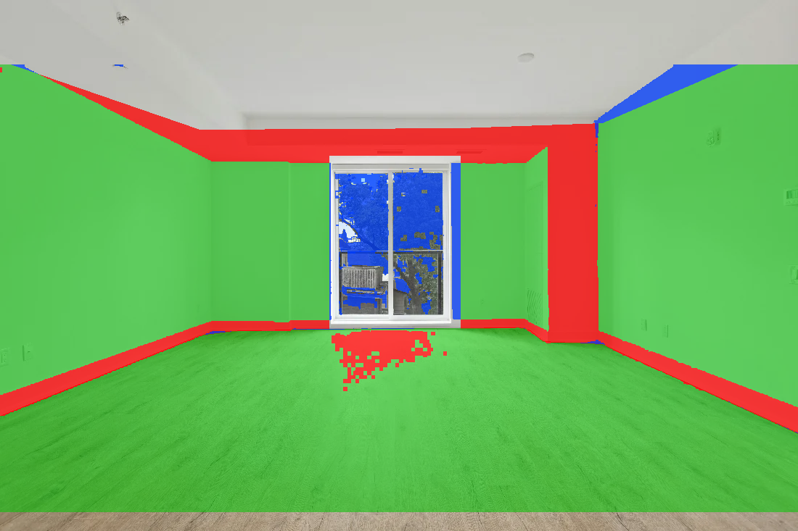
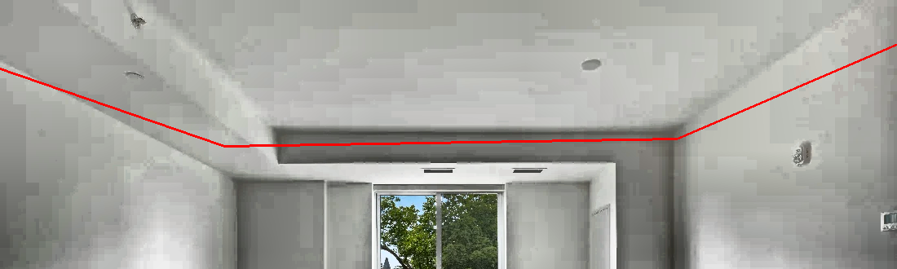
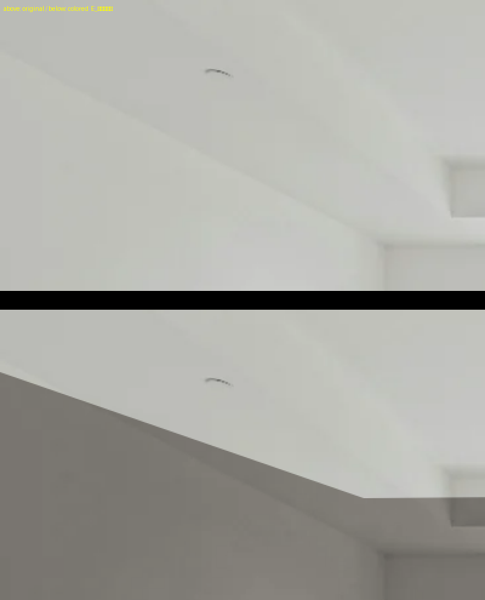

# `/try`・`/demo` の面（壁・床）の精度調査（2026-07-30）

指示 017 に対する調査報告。**実装はしていない**（方針は指示者が判断）。

対象は `api/_site.py` の `TRY_ROOM`（壁5面・床1面の正規化ポリゴン）と、それを使う
`ROOM_ENGINE_JS`。写真は `lp-assets/try-room-1.webp`（1100×733）。

---

## 0. 検証の当たりをつけた方法（重要）

途中で運営から **「格納した before/after の壁を比較すれば、どこが壁か参考になる」** という
指摘を受けた。これが決定打になった。

`lp-assets/moyougae-simulation-after.webp` は、**同じ部屋を Room Studio 本体（SAM／ポリゴン
選択）で壁と床だけ変えた実出力**である。したがって before との差分は、**本体の高精度な
面定義そのもの**であり、`/try` の簡易ポリゴンを突き合わせる正解データとして使える。
おまけに壁が水色になるため、**白同士で検出できなかった天井境界が高コントラストで取れる**。

座標系の対応（LP画像は master の上89px・下26pxを落として拡大したもの）:

```
master_x = X * 1100/1600
master_y = 89 + Y * 618/900
```

`try-room-1.webp` は master と同寸なので、これでポリゴンと直接比較できる。
以降の「正解」はすべてこの方法で作ったマスクを指す。

⚠️ 制約: 比較できるのは master の y89〜707 の範囲だけ（LPのトリミング分）。また窓ガラスは
空が青いため私の壁判定（青寄り）が誤検出する。**窓の開口は集計から除外**した。

---

## 1. 現状の精度

### 1-1. 正解マスクとの一致（窓を除外した集計）

| 面 | IoU | 塗り残し | **はみ出し** |
|---|---|---|---|
| **壁** | **0.799** | 1.6% | **19.0%（62,928 px）** |
| 床 | **0.969** | 0.2% | 2.9%（6,799 px） |

**床はほぼ正確。問題は壁で、塗っている面積の約1/5が壁ではない。**

正解では対象外なのにポリゴンが塗る画素は **68,526 px（可視領域の8.5%）**。その分布は
**天井際（y<300）が48%、床際（y>430）が38%** で、境界の2本に集中している。



緑=一致／**赤=はみ出し**／青=塗り残し。天井際と床際に赤い帯が通っているのが本質。
窓の中の青と、窓下の床の赤は上記の測定上の制約によるもので、実害ではない。

### 1-2. 壁と天井の境界 ← **最大の問題**

列ごとに「壁の上端」を正解とポリゴンで比較（master座標・負=ポリゴンが上=天井を塗る）:

| x範囲 | 平均ずれ | 最大 |
|---|---|---|
| 0-220 | −9.6 px | −26 px |
| 220-440 | **−40.9 px** | −47 px |
| 440-660 | **−62.1 px** | −173 px |
| 660-880 | −24.1 px | −51 px |
| 880-1100 | +9.5 px | +39 px |

全体で平均 −23.1 px / 中央 −27 px。**ほぼ全幅で天井を塗っている**。右端だけは逆に
ポリゴンが下がりすぎて壁が塗り残る。

原因は写真の構造にある。この部屋は **下がり天井（折上天井）** で、壁と天井の境目は
1本の線ではなく **幅50px前後の段差の帯**である。コントラストを上げると見える:



赤線が現行ポリゴンの上端。**帯の中を横切っており、帯の下半分だけが壁色になる**。
実測でも、x=600 の列で y=196 から着色が始まるが、下がり天井の面は y≈164〜224 に広がる。

着色後の拡大（上=元／下=着色後）。境界が完全な直線で、造作に沿っていない:



### 1-3. 壁と床の境界 ← **平坦部は良好**

基準を「明るい幅木の下端」に取ると:

| x範囲 | 平均ずれ | 最大 |
|---|---|---|
| 0-220 | −0.4 px | −1.0 px |
| 220-440 | −1.1 px | −5.0 px |
| **440-660（窓の下）** | **−7.5 px** | **−45 px** |
| **660-880（入隅・ガラリ）** | **−3.2 px** | **−42 px** |
| 880-1100 | −1.0 px | −2.0 px |

全体では |ずれ|>3px が13%、>8px が4%。**平坦な壁の直線部は ±1〜2px で正確**であり、
誤差は**窓の下端と入隅の2箇所に集中**している。

> ⚠️ 自己訂正: 最初の走査では「平均+14px ずれている」と出たが、これは幅木の下の
> 影の帯の下端を拾っていた測定側の誤りだった。正しい基準では上表のとおり良好である。

### 1-4. 窓まわり — 3面で囲む方式の取りこぼし

- コメント記載の開口: x 453-636 / y 215-445 px。実測のガラスは x 468-609 / y 244-431 px
- **窓の下端（y=445）から床線（y≈454）までの帯を、どの壁ポリゴンも覆っていない**
  - 「窓の左」は x<0.412、「窓の右」は x>0.578、「窓の上」は y<0.293 しか覆わない
  - 実測: canvas 座標で **y485-495（高さ11px）× x494-693（幅199px）の帯が97%未着色**

### 1-5. 造作の扱い — すべて壁と一緒に塗られる

着色前後の画素を実測:

| 箇所 | 判定 |
|---|---|
| コンセント（右壁） | **着色された**（変化76） |
| スイッチ（右壁） | **着色された**（変化77） |
| ガラリ／通気口 | **着色された**（変化74） |
| 天井（中央） | 維持 ✅ |
| 下がり天井の面（上半分） | 維持 ✅（下半分は塗られる） |

幅木は、ポリゴンの線が「明るい幅木の下端」に来ているため、**幅木の白い面は壁色**になり、
その下の影の帯は床色になる。実際の塗り替えなら白いまま残す部分なので、忠実ではない。

---

## 2. ずれの原因

指示で挙げられた4つの仮説を、それぞれ検証した。

| 仮説 | 判定 | 根拠 |
|---|---|---|
| **直線近似の限界（境界が直線でない）** | **✕ 主因ではない** | 実測境界に直線をあてはめた残差 RMS 8〜27px に対し、**2次曲線にしてもほぼ改善しない**（10.4→9.5、27.4→24.9）。残差の正体は曲率ではなく低コントラスト部の検出ノイズ。境界そのものは実質まっすぐ |
| **走査による境界検出の精度不足** | **◯ 部分的に主因** | 壁/天井は白×白でエッジがほぼ無く、当初の走査では左壁の稜線が1列も取れなかった。**定義時の読み取りが困難で、そこで入った誤りがそのまま残っている**。実際そこが最大の誤差箇所 |
| **頂点数の不足** | **◯ 主因の一つ** | 下がり天井は「壁→立ち上がり→天井」の段差で、**2点の直線1本では原理的に表現できない**。同様に入隅・ガラリ・窓の下端も頂点不足で最大45px の誤差 |
| **窓を3面で囲む方式の無理** | **◯ 実害あり** | 窓の下に 11×199px の未定義帯が残る。「穴あきポリゴン」を面の分割で代用したことによる取りこぼしで、面を足すほど同種の隙間が増える |

**総括**: 「直線で近似したこと」自体は妥当で、**壁と床の直線部は ±1〜2px と十分な精度**が
出ている。問題は **(a) 白×白で境界を読み取れなかった天井側の定義誤り**と、
**(b) 下がり天井・入隅・窓下といった “線1本では表せない造作” を頂点不足のまま押し通した**
ことの2点に集約される。**手法の限界ではなく、定義の精度と表現力の不足**である。

---

## 3. 改善案

### 前提を1つ覆す — 「座標のほうが軽い」は成立しない

3値マスク（0=対象外／1=壁／2=床）を実際に書き出して実測した（可逆・復号一致1.0000）:

| 解像度 | PNG | **WebP可逆** |
|---|---|---|
| 1100×733（原寸） | 4.83 KB | **2.62 KB** |
| 800×533 | 3.35 KB | 1.88 KB |
| 550×367 | 2.35 KB | 1.39 KB |

現行のポリゴン座標は JSON 直書きで 0.53KB（gzip後 約0.18KB）。
**差は +2.4KB にすぎない**（初回表示300KB要件の **0.8%**）。

軽量化のために座標を選んだ判断は、**差が2.4KBだと分かっていれば成り立たなかった**。
マスクが重いという前提が誤っていたのであって、トレードオフの読み違いですらない。

### 案1: ポリゴンの精緻化（頂点を増やす・造作を除外領域にする）

- **精度**: 中。天井の段差と入隅に頂点を足せば主要な誤差は消せる。ただしコンセント・
  スイッチ・ガラリまで多角形で抜くのは現実的でない
- **実装コスト**: 中。座標の引き直しが必要で、**部屋を差し替えるたびに人手で再実測**
- **性能**: 影響なし（座標が数十点増えるだけ）
- **難点**: 除外領域を扱うにはエンジンに「穴」の概念を足す必要がある（現状は面の分割で
  代用していて、それが窓下の取りこぼしを生んでいる）

### 案2: マスク画像方式 ← **推奨**

座標ではなく3値マスクを1枚配信し、エンジンはピクセル単位でマスクを引く。

- **精度**: 高。造作・段差・穴をすべて表現できる。上限は元マスクの品質そのもの
- **転送量**: **+2.4KB**（WebP可逆・原寸）。要件に対して無視できる
- **性能**: 実行時はマスクを1枚デコードして参照するだけ。**現状の「点が多角形の内側か」
  判定より、むしろ軽くなる可能性が高い**（ピクセルごとの内外判定が配列参照になる）
- **実装コスト**: 中。エンジンの面判定をポリゴンからマスク参照に差し替える。
  `/try` と `/demo` は `ROOM_ENGINE_JS` を共有しているので**1箇所の変更で両方に効く**
- **副次効果**: 部屋を差し替えるとき、**座標の再実測が不要**になる

### 案3: 本体の技術を流用し、生成済みマスクを静的アセットとして持つ ← **案2と併用が最善**

実行時に SAM を動かすのではなく、**本体で一度だけ高精度マスクを作り、書き出して配信する**。

- **実現可能性**: **すでに実証済み。** 本調査の「正解マスク」がまさにこれで、
  `moyougae-simulation-after.webp` は本体の SAM／ポリゴン選択で作られた実出力であり、
  そこから **IoU の基準に足る品質のマスクを実際に取り出せた**
- **精度**: 最高。本体の面選択の品質がそのまま乗る
- **性能**: 実行時コストはゼロ（ただのアセット）。本体もページも読み込まない
- **実装コスト**: 小〜中。本体に「面マスクを PNG/WebP で書き出す」導線を足すのが素直。
  当座は**本調査のスクリプトで作ったマスクをそのまま置ける**
- **注意**: 現在の正解マスクは LP のトリミング範囲（master y89〜707）しか覆っていない。
  `/try` 用に全面を得るには、本体で `try-room-1.webp` を読み込んで面を取り直すのが確実

### 案4（併記）: 定義の正しさを継続的に検証する仕組み

どの案でも、**面の定義が正しいかを人手の目視で担保するのは危うい**（今回の天井の誤りは
まさにそれで見逃された）。案2/3に進むなら、**本調査の突き合わせスクリプトを
`tools/` に残し、マスクを更新したら IoU を出す**運用にしておくと、同じ失敗を繰り返さない。

### 推奨

**案3で高精度マスクを作り、案2の方式で配信する。** 案1は、部屋を差し替えるたびに人手の
再実測が要る点で将来のコストが下がらず、造作の除外にも届かない。案2+3なら転送量の増加は
+2.4KB に収まり、精度の上限は本体と同じになる。

なお **`/try`・`/demo` は現在非公開**（指示015）なので、この修正は公開再開の前提条件で
あって、単独で急ぐ必要はない。`docs/TRY_DEMO_REVIEW.md` の再設計方針と合わせて判断されたい。

---

## 付録: 再現方法

調査に使ったスクリプトはスクラップパッドに置いてある（リポジトリには入れていない）。
`/try` を手元で開くには環境変数 `ENABLE_TRY_DEMO=1` を付けてサーバを起動する。

```
APP_MODE=public ENABLE_TRY_DEMO=1 python -m uvicorn api.index:app --port 7906
```
